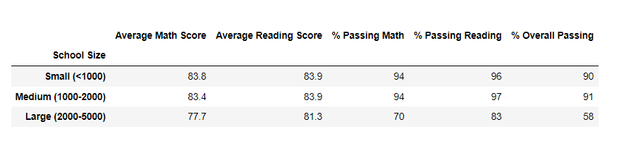

# School-District_Analysis

## Overview of the school district analysis

The main objetive of this data analytics project is to clean the data since there are evidence of its alteration, and then run the analysis again with a cleared data to avoid a missinterpretation of the results, to understand better the performance of schools and students.

## Results

- The data afected was the percentage of passing math, reading, overall and the average grades, but in the general school summary its hard to notice the main differences since we have a large data set, and we only take out over 400 from 39,170. The main difference can see below at decimal level in Thomas High School.

Exhibit A: School Summary.

- Before running the code for Thomas High School and only taking out the data of the 9th grades levels there were significant differentes amoung the averages and percentages of passing.

Exhibit B: School Summary before running the fixing code.

- After running the code without taking in consideration the Thomas High School Data Set for 9th grades levels, the difference in the data can be seen only at the decimal level. Since there were only over 400 grades for each (math, reading and overall passing scores).

Exhibit C: School Type Summary after running the fixing code.

## Summary

- This analysis its very interesting since it has a real application and business case of use, the data analyzed by school size and correlated with the average results can help to understand the students performance with overpopulated schools, since data shows that schools with less than 2000 students tent to performe better.

Exhibit D: School Summary by size and performing results

- Finally another interesting analysis is the expending per student related with the average scores, can be infered that schools that invest more per students are not having an impact in the overall passing rate, since shools that invest $630 and above has the bottom results.

Exhibit E: School Summary by size and performing results

